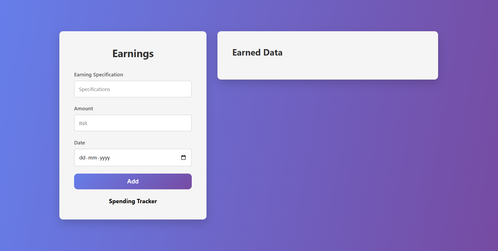
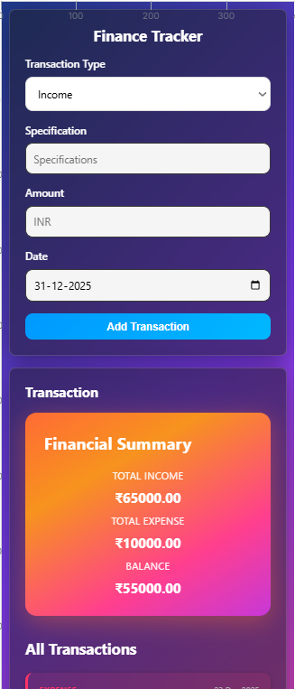
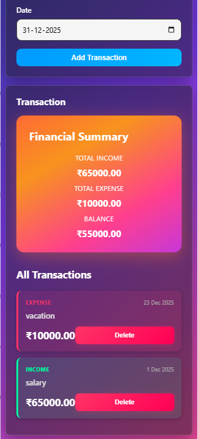

# Expense Tracker

A simple web app to track daily earnings and expenses.  
Built using **HTML, CSS, and JavaScript** — stores data locally using the browser's localStorage.

---

## 🚀 Features
- Add and view earnings
- Add and view expenses
- Simple UI, clean layout
- Works fully offline (no backend)

---

## 🧠 How It Works
1. Go to **Earned.html** to log earnings.
2. Go to **Spent.html** to log expenses.
3. Data is stored in localStorage and displayed dynamically.

---

## 🛠️ Tech Stack
- HTML
- CSS
- JavaScript (Vanilla)

---

## 📷 Preview
- On Big screens(Laptops/Desktops)

---
- On Small screens(Mobiles)

---

---

